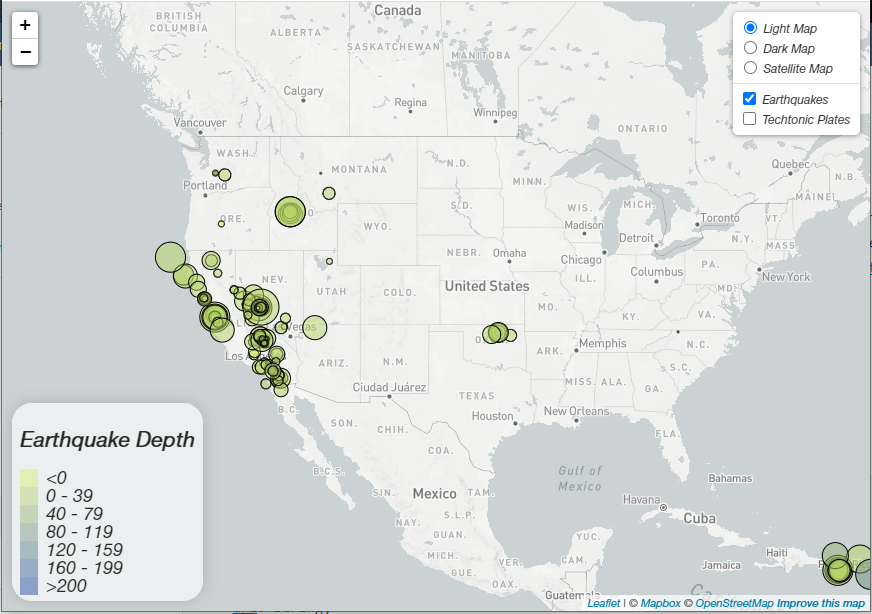
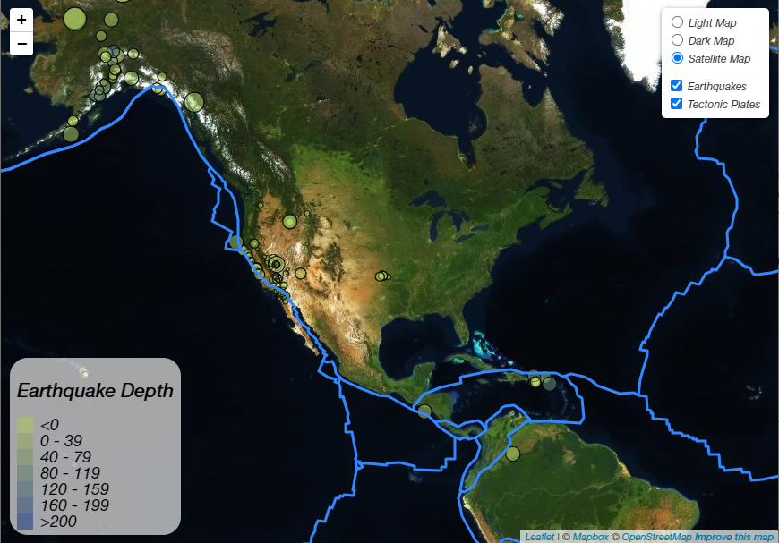

# Leaflet Challenge - Earthquake Mapping from USGS

This application makes practical use of the [Leaflet JS](https://leafletjs.com/) library to perform geospatial analysis on live earthquake data available from the [United States Geological Survey](https://earthquake.usgs.gov/earthquakes/feed/v1.0/geojson.php) (USGS) and create an attractive and simple interactive visualization.

## Map Features

The leaflet map presents a visualization of the locations, magnitudes, and depths of all earthquakes reported by USGS within the past 24 hours. This data is retrieved from the USGS geoJSON database which is updated once every minute, providing the view with up-to-date information. The user can update the map by refreshing the page in the browser.

The earthquakes are indicated by circular markers on the map, with the diameter of the circle scaled with the magnitude of the earthquake. The circles are colored according to the depth of the earthquake, with the legend in the bottom left corner of the map providing the viewer with a guide to deciphering depth according to circle color. The earthquake markers can also be clicked by the user to reveal a tooltip which provides additional details about the location, magnitude, and depth of the earthquake.

Finally, the map features layer control which allows the user to toggle between three different base maps (light, dark, and satellite) and add or remove the earthquake markers and tectonic plate boundary lines.

## Outline of the Code

The code executes as follows:
1. The USGS geoJSON website is quered using the `d3.json() ` function from the D3 JavaScript library. The JSON response containing the earthquake data is returned.
2. Within the USGS query, another `d3.json()` call is executed to read in a local plate tectonics geoJSON file, returning the geoJSON data from that file.
3. The responses from the `d3.json()` calls made in steps (1) and (2) are respectively passed to the functions `markEarthquakes()` and `markPlates()`
4. Within the `markEarthquakes()` function, the earthquake geoJSON response is parsed to obtain the coordinates, magnitude, depth, and location description for each earthquake. For each earthquake, a circular marker is created using the leaflet `L.circle()` method whose radius is proportional to the magnitude of the earthquake and whose color is reflective of the earthquake's depth. The function also binds a popup to each marker containing the tooltip information. All circular marker objects are pushed to an array called `earthquakeMarkers`, which is then convered into a layer group with the leaflet `L.layerGroup()` function. The earthquake markers layer group is returned by the `markEarthquakes()` function.
5. The `markPlates()` function has the simple task of  returning the tectonic plate geoJSON data as a geoJSON layer, using the `L.geoJSON()` function.
6. The returned earthquake marker layer and tectonic plates layer from steps (4) and (5) are passed into the `createMap()` function.
7. `createMap()` accepts the marker and plate boundary layers and renders the map by performing the following:
  - Calling `L.tilelayer()` to create the light, dark, and satellite base maps
  - Assigning the earthquake marker and tectonic plate layer groups to an overlay layers object
  - Calling `L.map()` to initialize the map with the light base and earthquake markers rendered. The `worldCopyJump` property of the map is set to `true` so that the map features automatically regenerate when the user scrolls the map on screen.
  - Calling `L.control()` to create and construct a legend for the circle colors and earthquake depths
  - Calling `L.control.layers()` to add layer control with the additional base map options and overlay map options